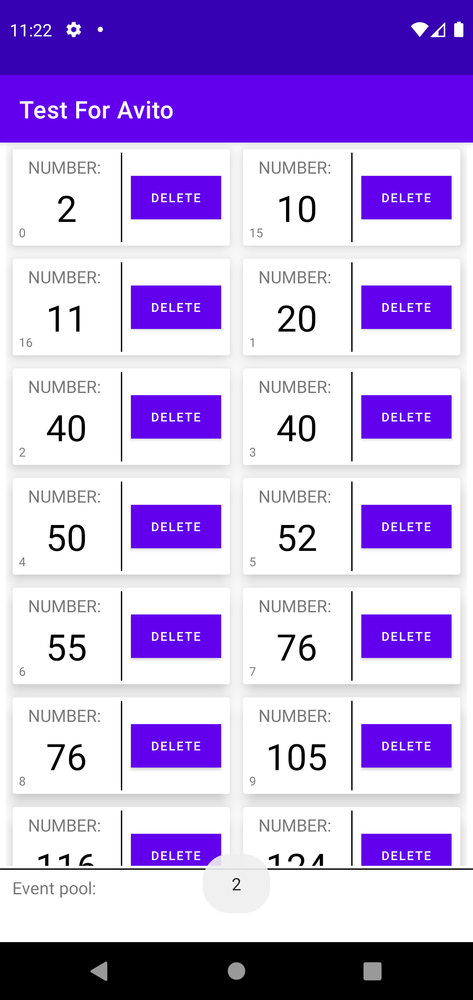
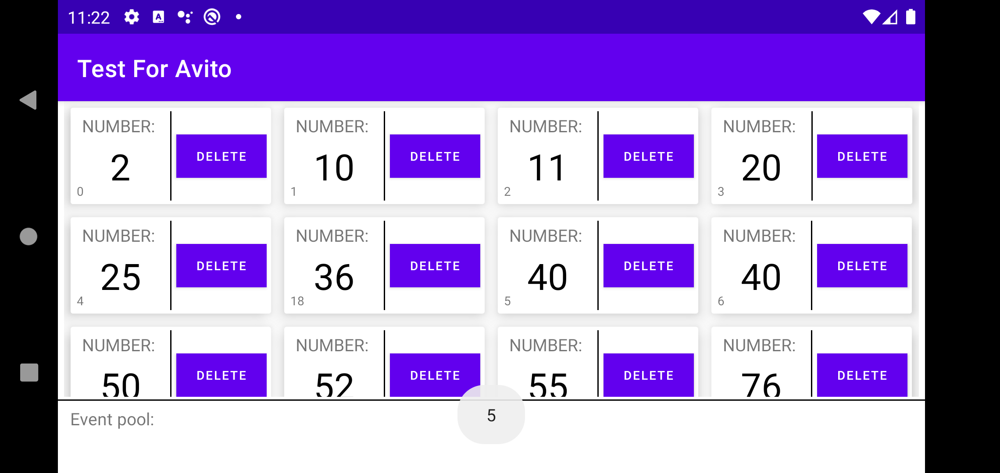

# Test_For_Avito
Recycler View + Async + Change phone rotate

# Изменчивый Recycler
У нас есть экран с RecyclerView, на нем есть список в два столбца, изначально 15 элементов.  :white_check_mark: 

## Требования:

  - У элемента отображается его номер и кнопка удалить, которая его удаляет, то есть такая плиточка с номером и кнопкой  :white_check_mark: 
  
  - В системе работает что-то асинхронное, которое раз в 5 секунд добавляет новый элемент на случайную позициию  :white_check_mark:

  - Номер элемента все время наращивается  :white_check_mark:

  - Добавления и удаления производятся с анимацией (можно стандартной) :white_check_mark:

  - Вся эта система поддерживает поворот экрана и продолжает работать после него :white_check_mark:

## Требования посложнее:

 - Сделать пулл номеров удаленных элементов и новые добавлять из пула, и если там пусто просто наращивать номер - :white_check_mark:
 - В вертикальном положении сделать две колонки, в горизонтальном четыре -:white_check_mark:
 ## Примечания:

 - Задание желательно выполнять на Kotlin. - :white_check_mark:

 - Выполненное задание нужно загрузить на github -:white_check_mark: 
##
 

